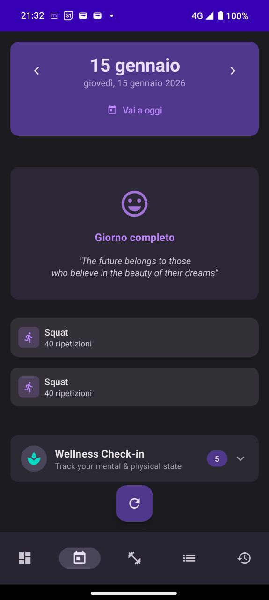
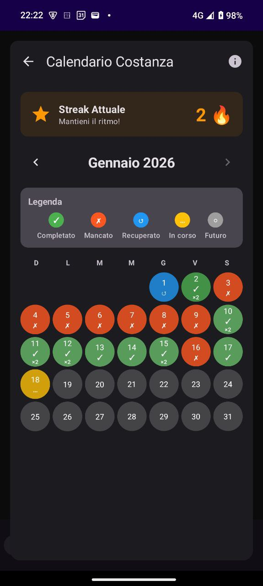

# 🏋️ Good Habits

<div align="center">


### **Your phone counts your squats. For real.**

*An experiment born from curiosity: Kotlin, Computer Vision, and AI in your pocket.*

[📥 Download](#-download) • [🎯 Features](#-what-it-does) • [🛠️ Tech](#-how-its-built)

</div>

---

## 💡 Why This Project Exists

> *"You do not rise to the level of your goals. You fall to the level of your systems."*  
> — **James Clear, Atomic Habits**

This project was born from a simple question: **What if technology could make good habits effortless?**

Inspired by **Atomic Habits**, I wanted to build a system that:

✨ **Makes habits obvious** → AI counts your reps automatically  
✨ **Makes them attractive** → Beautiful UI, instant feedback  
✨ **Makes them easy** → Just point your camera and start  
✨ **Makes them satisfying** → See your progress, break the chain

But beyond habit formation, this was my personal journey to:

🔬 **Explore Computer Vision** on Android (pose detection is hard!)  
🧠 **Master TensorFlow Lite** (ML on-device is fascinating)  
🎨 **Build with Jetpack Compose** (declarative UI done right)  
📚 **Learn by doing** (not just reading docs)

> *"Every action you take is a vote for the type of person you wish to become."*

This app votes for consistency. One squat at a time.

---

## 📱 See It In Action

<div align="center">
<table>
  <tr>
    <td align="center">
      
      <br/>
      <b>🤖 AI Squat Counter</b>
      <br/>
      <i>Real-time pose detection</i>
    </td>
    <td align="center">
      
      <br/>
      <b>📅 Daily Session</b>
      <br/>
      <i>Track your workouts</i>
    </td>
    <td align="center">
      
      <br/>
      <b>🔥 Streak Tracking</b>
      <br/>
      <i>Don't break the chain</i>
    </td>
  </tr>
</table>
</div>

---

## 🎯 What It Does

### 🤖 **AI-Powered Squat Detection**
- Real-time pose recognition (**30 FPS**)
- Automatic rep counting
- Front/back camera support
- **100% on-device** (privacy first, no cloud)

### � **Complete Workout Tracking**
- **90+ exercises** ready to use (squats, push-ups, planks, cardio, stretching)
- Create custom workouts or use templates
- Calendar with **streak tracking** (don't break the chain!)
- Export data in **CSV/JSON/TXT**

### 🧘 **Wellness Tracking**
- Track mood, energy, sleep, stress
- **18 emotional trackers** built-in
- Separate from workouts (mental health matters too)

---

## 🛠️ How It's Built

**Core Stack:**
```kotlin
Jetpack Compose + Material3  // Modern UI
TensorFlow Lite + MoveNet    // AI pose detection
Room Database + Coroutines   // Data persistence
MVVM + Clean Architecture    // Solid foundation
```

**The Interesting Part:**
- **MoveNet Lightning** → Optimized ML model (~4MB)
- **GPU-accelerated** → Hardware inference when available
- **17 body keypoints** → Full pose tracking
- **Custom squat logic** → Validates proper form

> *"A habit must be established before it can be improved."*  
> This app establishes the system. You improve the reps.

---

## 📥 Download

### **Quick Install**
```bash
# Download latest release
https://github.com/plana93/good-habits/releases

# Install via ADB
adb install good-habits-v1.1.0-debug.apk
```

### **Build from Source**
```bash
git clone https://github.com/plana93/good-habits.git
cd good-habits
./gradlew assembleDebug
adb install app/build/outputs/apk/debug/app-debug.apk
```

**Requirements:** Android 7.0+ (API 24) | ~50 MB | Camera permission

---

## 🎓 For Developers Who Want to Learn

This project is **open source** for a reason. If you want to:

- 🔬 Explore **TensorFlow Lite** on Android
- 🎨 Learn **Jetpack Compose** in a real-world project
- 🏗️ Study **Clean Architecture + MVVM**
- 🤖 Experiment with **Computer Vision**

**Clone it. Break it. Fix it. Learn.**

> *"The purpose of setting goals is to win the game. The purpose of building systems is to continue playing the game."*

### Technical Documentation
- [📖 Technical Guide](update_docs/TECHNICAL_GUIDE.md) - Deep architecture dive
- [🏗️ Build Guide](update_docs/05_BUILD_DEPLOY_GUIDE.md) - Development setup
- [📋 Roadmap](update_docs/02_DEVELOPMENT_ROADMAP.md) - What's next

---

## 🤝 Contributing

Got an idea? Found a bug? Want to add an exercise?

1. **Fork** the repo
2. **Experiment** in your branch
3. **Submit** a Pull Request

No corporate BS. Just clean code and curiosity.

---

## 📄 License

**MIT License** - Do what you want, just give credit 🙏

---

<div align="center">

### **⭐ If this sparks your curiosity, leave a star ⭐**

> *"You do not rise to the level of your goals. You fall to the level of your systems."*  
> **This is my system for building systems.**

*Built with curiosity, passion, and too much caffeine ☕*

**Mirco** • [@plana93](https://github.com/plana93) • 2026

</div>

